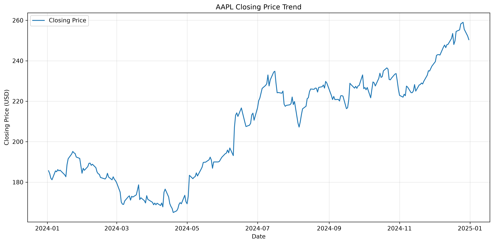
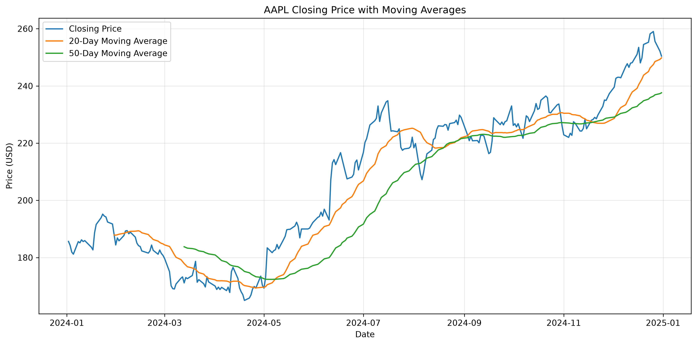
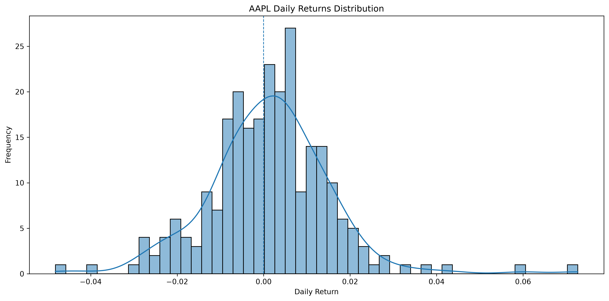

# Stock Price Data Visualization

This project analyzes the historical stock price of Apple Inc. (AAPL) using time-series data. It includes visualizations of the closing price trend, 20-day and 50-day moving averages, and the distribution of daily returns.

## Project Overview

The project focuses on:

- Historical closing price trends
- 20-day and 50-day moving averages
- Daily returns distribution
- Return and volatility statistics
- Reproducible analysis using different stock tickers and date ranges

## Dataset and Data Source

- **Stock:** Apple Inc. (AAPL)
- **Ticker:** AAPL
- **Data Source:** Yahoo Finance
- **Python Library:** yfinance
- **Date Range:** January 1, 2024 to January 1, 2025
- **Interval:** Daily
- **Price Used:** Closing Price

The historical stock data was downloaded programmatically using the `yfinance` library.

## Visualizations

### 1. Closing Price Trend

Shows the historical closing price of AAPL throughout the selected period.



### 2. Moving Averages

Compares the AAPL closing price with its 20-day and 50-day moving averages.



### 3. Daily Returns Distribution

Shows the distribution of AAPL's daily percentage returns using a histogram with a KDE curve.



## Key Results

For the selected period:

| Metric | Result |
|---|---:|
| Total Return | 34.90% |
| Mean Daily Return | 0.1292% |
| Daily Volatility | 1.4125% |
| Annualized Volatility | 22.42% |
| Largest Daily Gain | 7.26% |
| Largest Daily Loss | -4.82% |
| Positive Trading Days | 142 |
| Negative Trading Days | 108 |

## Volatility and Return Interpretation

From January 2024 to January 2025, AAPL recorded a total return of 34.90%, with an average daily return of 0.1292%. The stock had a daily volatility of 1.4125%, equivalent to an annualized volatility of 22.42%, indicating noticeable day-to-day price fluctuations during the period.

AAPL had 142 positive trading days and 108 negative trading days, meaning positive-return days occurred more frequently within the selected period. The largest daily gain was 7.26%, while the largest daily loss was -4.82%.

The results show that AAPL generated a positive return during the selected period while also experiencing noticeable daily price variation.

## How to Reproduce

### 1. Clone the repository

```bash
# Clone the project repository from GitHub
git clone https://github.com/jeysiii02/DS_3_StockPriceDataVisualization_byte.git